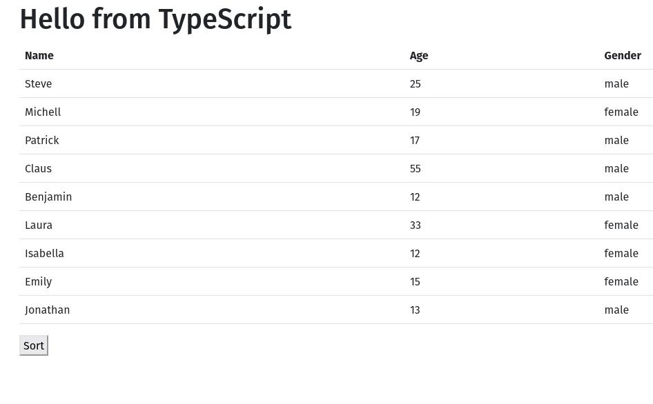

# Transform JavaScript to TypeScript

## Setup and Instructions

1. Create a simple npm project with a `package.json` file.
2. Create a `ìndex.html`, `index.ts` and a `person.ts` file in the root of your project.
3. Copy the code from [Git-Gist](https://gist.github.com/tysker/3ef2d526a3d345f1dcabfc36d50e3075) into the `index.html` file.
4. Copy the code from [Git-Gist](https://gist.github.com/tysker/dc9a497a72ca3d1637c6c5346cc3184c) into the `index.ts` file.
5. In the `person.ts` file, create a `Person` class with the following properties:
    - `name` (string, private, readonly)
    - `age` (number, private, readonly)
    - `gender` (string, private, readonly)
6. Create a getter for each property.
7. Create a `enum` called `Gender` with the following values:
    - `Male`
    - `Female`
8. Export the `Person` class and the `Gender` enum and import them in the `index.ts` file.
9. Refactor the `index.ts` file, so TypeScript is not complaining anymore about any type errors.
10. Some types are handled by TypeScript automatically, we call them `implicit types` or `type inference`. 
I want you to add explicit types to all the variables, parameters and return values in the `index.ts` file.
11. Run the `index.html` file in your browser and open the console to see the result.

