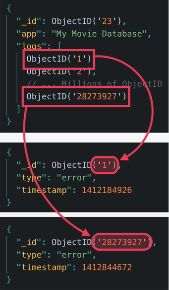

# MongoDB Data Modeling & Mongoose Middleware

## Links

- [MongoDB Data Models](https://www.mongodb.com/docs/manual/core/data-modeling-introduction/)
    - Chapter: Data Modeling Concepts
    - Chapter: Data Model Examples and Patters
    - Chapter: Data Model References

- [MongoDB Atlas](https://www.mongodb.com/atlas)
- [Learn MongoDB](http://learnmongodbthehardway.com/schema/)
- [Mongoose Documentation](https://mongoosejs.com/)

Different data models are suited to different use cases. This chapter describes some of the data model concepts and
patterns
that MongoDB supports, and provides examples of how to use them.

## Types og Relationships between Data in MongoDB

- One-to-One - One document in one collection references one document in another collection.
- One-to-Many - One document in one collection references many documents in another collection.
- Many-to-Many - Many documents in one collection reference many documents in another collection.

## Data Model Patterns

- Embedded - Embed related data in a single document.
- Referenced - Reference related data in a separate document.
- Denormalized - Duplicate data across multiple documents.
- Normalized - Store related data in a single document.

## Reference vs Embedded

In MongoDB, there are two ways to represent relationships between different documents:

1. Reference (Normalization): A reference is a field that contains a reference to another document in the database.
   The value of the reference field is usually the _id field of the related document. This method is also known as
   normalization, and it allows for better data consistency and reduces data redundancy. However, it requires multiple
   queries to fetch related data.
2. Embedded (Denormalization): In the embedded method, the related data is embedded directly within the main document
   as a nested object or array. This method is also known as denormalization, and it improves query performance by
   reducing
   the number of queries required to fetch related data. However, it can result in data duplication and inconsistencies
   if
   not properly managed.

So, the main difference between reference and embedded in MongoDB is the way relationships between different documents
are represented. Reference uses a separate document to represent relationships, while embedded stores the related data
directly within the main document.

## Referenced / Normalized

Positive:

- Performance. It's easier to query the data. We only need to query the data from the referenced document.

Negative:

- We need to keep the data in sync.
- We need to make sure that the data is not duplicated.
- We need to make sure that the data is not deleted.
- We need to make sure that the data is not updated.
- We need 2 queries to get the data from the referenced document.


## Embedded / Denormalized

Positive:

- Performance. We can get all the information we need in one query.

Negative:

- More data in one document
- More data to transfer
- More data to store
- Impossible to query the embedded data without the main document


## When to use Embedded vs Referenced

The decision of whether to use embedded or referenced relationships when modeling a database in MongoDB depends on
several factors, such as:

1. **Query patterns:** If your application needs to retrieve related data frequently and the related data is relatively
   large, it might be better to use embedded relationships to avoid the overhead of multiple queries.
2. **Data consistency:** If the related data needs to be updated frequently, it might be better to use referenced
   relationships to avoid duplicating data in multiple places and ensure data consistency.
3. **Data volume:** If the related data is relatively small and the main document has a large volume of data, it might
   be better to use referenced relationships to avoid bloating the main document.
4. **Data structure:** If the related data has a complex structure, it might be better to use referenced relationships
   to avoid complex nested data structures.

In general, embedded relationships work best when the related data is small and frequently accessed together with the
main document, while referenced relationships work best when the related data is large, frequently updated, or accessed
independently of the main document.

It's important to note that there is no one-size-fits-all solution and the decision to use embedded or referenced
relationships should be made based on the specific requirements of the application and the data being modeled.


## Types of referencing

- child referencing
- parent referencing
- two-way referencing

In MongoDB, there are three types of relationships that can be established between documents: **child referencing**, **parent
referencing**, and **two-way referencing**.

1. **Child referencing:** In child referencing, the child document contains a reference to its parent document.
   This is useful when you need to represent a one-to-many relationship, where multiple child documents are associated
   with
   a single parent document. For example, a blog post document might have multiple comment documents, and each comment
   document would contain a reference to the parent blog post document.
2. **Parent referencing:** In parent referencing, the parent document contains a reference to its child document(s).
   This is useful when you need to represent a many-to-one relationship, where multiple child documents are associated
   with
   a single parent document. For example, a customer document might have multiple order documents, and each order
   document
   would contain a reference to the parent customer document.
3. **Two-way referencing**: In two-way referencing, both the parent and child documents contain references to each other.
   This is useful when you need to represent a many-to-many relationship, where multiple child documents are associated
   with multiple parent documents. For example, a user document might have multiple favorite book documents, and each
   book document would contain references to the parent user documents, creating a two-way referencing relationship.

The choice between child referencing, parent referencing, and two-way referencing depends on the specific requirements
of the application and the data being modeled. It's important to consider the query patterns, data consistency, and data
volume when deciding on the type of relationship to use.

## Child referencing



## Parent referencing


## Two-way referencing


## Mongoose Middleware

- [Mongoose Middleware DOCS](https://mongoosejs.com/docs/middleware.html)
- [Mongoose Middleware PRE](https://mongoosejs.com/docs/middleware.html#pre)
- [Mongoose Middleware POST](https://mongoosejs.com/docs/middleware.html#post)
- [Mongoose Middleware ASYNC](https://mongoosejs.com/docs/middleware.html#async)

Mongoose middleware is a powerful way to execute code before or after an event. Mongoose middleware is executed
serially,
meaning that middleware functions are executed one after another, when each middleware calls next.

## Pre Middleware

Pre middleware functions are executed one after another, when each middleware calls next. It's important to remember
that
you must call next() to pass control to the next middleware function. Failure to do so will result in a hangup.
The `this` keyword refers to the document that is currently being processed.

```javascript
const mongoose = require('mongoose');
const Schema = mongoose.Schema;

const schema = new Schema({name: String});

schema.pre('save', function (next) {
    // do stuff
    next();
});

schema.pre('save', true, function (next, done) {
    // do stuff
    next();
    done();
});

schema.pre('find', function (next) {
    this.start = Date.now();
    next();
});

```

## Post Middleware

Post middleware functions are executed after the corresponding pre middleware functions (if any) have completed.

```javascript
const mongoose = require('mongoose');
const Schema = mongoose.Schema;

const schema = new Schema({name: String});

schema.post('save', function (doc, next) {
    // do stuff
    next();
});

schema.post('save', true, function (doc, next, done) {
    // do stuff
    next();
    done();
});

schema.post('find', function (docs, next) {
    console.log(`find() took ${Date.now() - this.start} millis`);
    next();
});
```

## Async Middleware

Async middleware functions are executed after the corresponding pre middleware functions (if any) have completed.

```javascript

const mongoose = require('mongoose');

const schema = new Schema({name: String});

schema.pre('save', true, function (next, done) {
    // do stuff
    next();
    done();
});

schema.post('save', true, function (doc, next, done) {
    // do stuff
    next();
    done();
});
```

## Mongoose Virtuals

- [Mongoose Virtuals DOCS](https://mongoosejs.com/docs/tutorials/virtuals.html)
- [Mongoose Virtuals GETTERS](https://mongoosejs.com/docs/tutorials/virtuals.html#getters)
- [Mongoose Virtuals SETTERS](https://mongoosejs.com/docs/tutorials/virtuals.html#setters)
- [Mongoose Virtuals POPULATE](https://mongoosejs.com/docs/tutorials/virtuals.html#populate)
- [Mongoose Virtuals REFERENCE](https://mongoosejs.com/docs/tutorials/virtuals.html#reference)

Mongoose virtuals are document properties that you can get and set but that do not get persisted to MongoDB. The getters 
and setters are useful for formatting or transforming the underlying values. Virtuals are typically used for computed 
properties on documents. Mongoose supports getters and setters using the Object.defineProperty() API.

## Getters

Getters are useful for formatting or transforming the underlying value of a document's property before returning it.
For example, you might want to return a property as a lowercase string, or you might want to return a truncated string 
with a specified number of characters.

## Setters

Setters are useful for formatting or transforming the user supplied value before saving it to the underlying MongoDB.
For example, you might want to ensure that all emails are stored in lowercase, or you might want to ensure that all
phone numbers are stored in a consistent format. Setters are executed before validation.

## Populate

Populate is a way to automatically replace the specified paths in the document with document(s) from other collection(s).
We may populate a single document, multiple documents, plain object, multiple plain objects, or all objects returned
from a query. For more information, see the [Populate DOCS](https://mongoosejs.com/docs/populate.html).
For example, if we have a BlogPost document that has a reference to a User document, we can populate the author
property of the BlogPost document with the actual User document.


               


