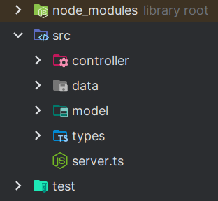

# Mongoose Exercise

- [Mongoose](https://mongoosejs.com/)
- [Typescript Support](https://mongoosejs.com/docs/typescript.html)


## Introduction

Use the following structure:



In this exercise, you will be using Mongoose to create a database and perform CRUD operations on it. 
You are going to have three different models: `Author`, `Book`, and `Library`. 

The `Author` model should have the following properties:

- `name` (String)
- `age` (Number)
- `books` (Array of ObjectIds)
- `createdAt` (Date)

The `Book` model should have the following properties:

- `title` (String)
- `author` (ObjectId)
- `library` (ObjectId)
- `pages` (Number)
- `genre` (enum: 'fiction', 'non-fiction', 'fantasy', 'mystery', 'thriller', 'romance', 'biography', 'history', 'science', 'other')
- `createdAt` (Date)

The `Library` model should have the following properties:

- `name` (String)
- `books` (Array of ObjectIds)
- `createdAt` (Date)

## Instructions

1. Create a new database called `library`.
2. Create the three models mentioned above.
3. Create a new author and save it to the database.
4. Create a new book and save it to the database.
5. Create a new library and save it to the database.
6. Create a function that adds a book to an author. But what if the author doesn't exist or the book? Does the book already belong to another author?
7. The same logic as the previous step, but now for the library and the book.
8. Add a validation to the `Book` model to make sure that the `pages` property is a positive number. (use a custom validator) [Link](https://mongoosejs.com/docs/validation.html)

When adding the relations, like adding a book to an author, make sure to use the `populate` method to get the full details of the book. 
Consider also if you just want a reference to an object or the full object in the document. For example, when adding a book to an author, you can just add the reference to the book or the full book object. 
Both ways are valid, but you need to consider the trade-offs of each approach. 


## Middleware (populate)

Link: [Middleware](https://mongoosejs.com/docs/middleware.html)

1. use the `pre` middleware to add the current date to the `createdAt` property of the all the models before saving it to the database.
2. use the `post` middleware to populate the `books` property of the `Author` model after saving it to the database. Why? Because you want to get the full details of the books when you get the author. Also do this for the `Library` model.
3. On the Model use a `static` method to get all the authors that have more than 2 books.
4. Find out when and how to use the `virtual` property of the model. [Link](https://mongoosejs.com/docs/guide.html#virtuals) and then implement it in the `Author` model to get the full name of the author.

Code example:

```typescript
// if actor id is already in the movie, do not add it again
movieSchema.methods.addActor = function(actorId: string) {
    if (!this.actors.includes(actorId)) {
        this.actors.push(actorId);
    }
    // this.save() ensures that any changes made to the document are persisted and reflected in the database.
    return this.save();
}
```


