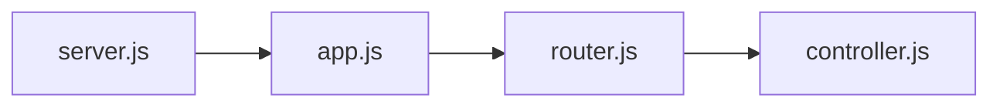

# Express Middleware, Error Handling and MongoDB/mongoose

**!!! warning
    This is a work in progress. I will be adding more content to this document as we go along.**

**!!! warning
    Until next class you need to have signed up for a MongoDB Atlas account. The link can be found in the `Link` section below.**

## Refactoring 

Last time around we had all logic in one file. Today we will be refactoring to make our code more modular.
When we are done we will have the following files and structure:



### server.js

The server.js file will be responsible for starting the server and connect to our database.

### app.js

The app.js file will be responsible for setting up our express application. This includes setting up our middleware and routes.

### router.js

The router.js file will be responsible for setting up our routes. This includes setting up our routes and the controller 
functions that will be called when a route is hit.

### controller.js

The controller.js file will be responsible for handling the logic for each route. This includes reading and writing to the database.

    

## ExpressMiddleware (from the express docs)

Express is in its self a routing and middleware web framework that has minimal functionality of its own: 
An Express application is essentially a series of middleware function calls.

Middleware functions are functions that have access to the request object (req), the response object (res), 
and the next middleware function in the application’s request-response cycle. The next middleware function is commonly 
denoted by a variable named `next()`.

Middleware functions can perform the following tasks:

- Execute any code. 
- Make changes to the request and the response objects. 
- End the request-response cycle. 
- Call the next middleware function in the stack.


If the current middleware function does not end the request-response cycle, it must call next() to pass control to the 
next middleware function. Otherwise, the request will be left hanging.

An Express application can use the following types of middleware:

- Application-level middleware // app.use()
- Router-level middleware // router.use()
- Error-handling middleware  // app.use()
- Built-in middleware // express.json()
- Third-party middleware // morgan

***

## Express Error Handling

Error handling in Express is done through the use of middleware. The error-handling middleware is defined with four 
arguments instead of the usual three: (err, req, res, next). For example:

```js
app.use(function (err, req, res, next) {
  console.error(err.stack)
  res.status(500).send('Something broke!')
})
```

The error-handling middleware always takes four arguments. You must provide four arguments to identify it as an 
error-handling middleware function. Even if you don’t need to use the next object, you must specify it to maintain the 
signature. Otherwise, the next object will be interpreted as regular middleware and will fail to handle errors.

If you define multiple error-handling middleware functions, they are executed sequentially, just like regular middleware 
functions. The first error-handling middleware function that calls next() will transfer control to the next error-handling
middleware function. If no error-handling middleware function calls next(), the default Express error handler will be
invoked, which simply returns an Internal Server Error (500) status code to the client.

Read the docs for more info: https://expressjs.com/en/guide/error-handling.html

***

## MongoDB

MongoDB is a type of database that is designed to store and manage large volumes of unstructured or semi-structured data. 
Unlike traditional relational databases, which organize data into tables with strict relationships between them, MongoDB 
stores data in flexible, JSON-like documents that can have different fields and structures.

In a document database like MongoDB, data is organized into collections, which are analogous to tables in a relational 
database. Each document in a collection is a self-contained unit of data, with its own set of fields and values. Because 
the documents are stored in a JSON-like format, it is easy to store complex data structures, such as arrays and nested 
objects, within a single document.

One of the benefits of using a document database like MongoDB is its flexibility. You can add new fields to documents 
or change the structure of the documents themselves without having to modify the underlying database schema. This makes 
it easier to adapt to changing business requirements and data models.

Another advantage of MongoDB is its scalability. MongoDB can scale horizontally by distributing data across multiple 
servers, which allows it to handle large volumes of data and high levels of traffic.

Overall, MongoDB is a powerful tool for managing large volumes of unstructured data in a flexible, scalable, and 
efficient manner.

### Collections instead of tables

In MongoDB, a collection is a grouping of MongoDB documents. It is analogous to a table in a relational database.
A collection exists within a single database and stores documents that have a similar structure, but not necessarily 
the same fields.

Collections in MongoDB can be created implicitly or explicitly. When you insert a document into a collection, 
MongoDB will create the collection if it doesn't already exist. You can also create a collection explicitly using the 
createCollection() method or by using the shell command "db.createCollection()".

Once a collection has been created, you can perform various operations on it, such as inserting documents, updating 
documents, deleting documents, and querying for data. Collections in MongoDB are schema-free, meaning that documents 
within a collection can have different structures and fields. This makes it easy to work with data that may not have a 
fixed schema or that changes frequently.

MongoDB also provides various tools and features for managing collections, such as indexing for faster querying, 
aggregation pipelines for data processing, and sharding for horizontal scaling across multiple servers.

Overall, collections are a fundamental component of MongoDB's document-based data model and provide a flexible and 
efficient way to store and manage data.

### Key differences between MongoDB(document database) and relational databases

Relational databases and document databases are two different types of databases, each with their own strengths and 
weaknesses. Here are some key differences between them:

- **Data structure:** Relational databases store data in tables with a fixed schema, where each row represents a record and each column represents a field. Document databases, on the other hand, store data in flexible JSON-like documents, where each document can have its own unique structure and fields. 
- **Querying:** In a relational database, data is typically accessed using SQL queries, which involve joining tables together to retrieve data. In a document database, data is accessed using queries that match documents based on their fields and values. 
- **Scalability:** Relational databases scale vertically, meaning that they require increasingly powerful hardware as the amount of data grows. Document databases scale horizontally, meaning that they can distribute data across multiple servers to handle large amounts of data and traffic. 
- **Transactions:** Relational databases are known for their support of ACID transactions, which ensure that multiple database operations are executed atomically and consistently. Document databases generally have weaker support for transactions, but some offer more advanced features like multi-document transactions. 
- **Schema flexibility:** Relational databases have a fixed schema, meaning that the structure of the data is defined before data is inserted. Document databases are schema-less, meaning that data can be inserted without a pre-defined schema, making them more flexible and easier to change. 
- **Data normalization:** In a relational database, data is often normalized to eliminate redundancy and improve performance. In a document database, denormalization is common, where data is duplicated or embedded within a document to improve query performance.

Overall, the choice between a relational database and a document database depends on the specific requirements of your 
application. If your data has a fixed schema and requires complex queries, a relational database may be the best choice. 
If your data is flexible and requires high scalability, a document database may be more suitable.

***

## Mongoose

Mongoose is an Object Data Modeling (ODM) library for Node.js and MongoDB. It provides a higher-level, schema-based API 
for interacting with MongoDB, making it easier to work with MongoDB in a Node.js application.

Mongoose allows you to define schemas for your MongoDB documents, which can enforce data validation rules and provide 
a consistent structure for your data. With Mongoose, you can define complex document schemas with nested properties, 
defaults, and validation rules. This makes it easier to work with complex data structures and maintain data integrity.

Mongoose also provides a rich set of features, including support for middleware functions, virtual properties, and 
query builders. Middleware functions allow you to define pre- and post-save hooks that can perform custom operations 
on your data before or after it is saved to the database. Virtual properties allow you to define computed properties 
on your documents that are not persisted to the database. Query builders provide a fluent interface for constructing 
MongoDB queries, making it easier to write complex queries.

Overall, Mongoose is a powerful and flexible library that simplifies working with MongoDB in a Node.js application. 
It provides a higher-level, schema-based API that can improve productivity and maintainability of your code.


### Key differences between Mongoose and MongoDB

MongoDB and Mongoose are two different things that serve different purposes. MongoDB is a NoSQL document-oriented 
database, while Mongoose is an Object Data Modeling (ODM) library for MongoDB.

Here are some key differences between MongoDB and Mongoose:

1. Database vs. library: MongoDB is a database system that stores data in a document-oriented manner. Mongoose is a library that provides a schema-based API for interacting with MongoDB. 
2. Data storage: MongoDB stores data in a flexible JSON-like format called BSON. Mongoose provides a higher-level schema-based API for defining and working with MongoDB documents. 
3. Querying: MongoDB provides a rich query language for querying data stored in its database. Mongoose builds on top of MongoDB's query language, providing additional functionality and a more expressive API. 
4. Validation: MongoDB provides basic data validation capabilities, such as the ability to enforce data types and simple constraints. Mongoose provides a more powerful schema-based validation system that allows you to define complex validation rules for your data. 
5. Middleware: MongoDB does not provide a middleware system. Mongoose provides a middleware system that allows you to define pre- and post-save hooks, middleware functions, and other custom operations on your data.

Overall, MongoDB and Mongoose serve different purposes. MongoDB is a powerful NoSQL document-oriented database system 
that provides a flexible and scalable platform for storing and querying data. Mongoose is a library that provides a 
higher-level, schema-based API for working with MongoDB, making it easier to define and interact with MongoDB documents.

***

## Links

**Express Middleware**
- [What the heck is middleware?](https://www.youtube.com/watch?v=MIr1oxQ3pao)
- [Express Middleware Documentation](https://expressjs.com/en/resources/middleware.html)

**Error Handling**
- [Error Handling in Express](https://expressjs.com/en/guide/error-handling.html)
- [Express Error Handling Middleware Example](https://expressjs.com/en/resources/middleware/errorhandler.html)
  
**MongoDB**
- [MongoDB Atlas](https://www.mongodb.com/atlas)
- [Learn MongoDB](http://learnmongodbthehardway.com/schema/)

**Mongoose**
- [Mongoose Documentation](https://mongoosejs.com/)
