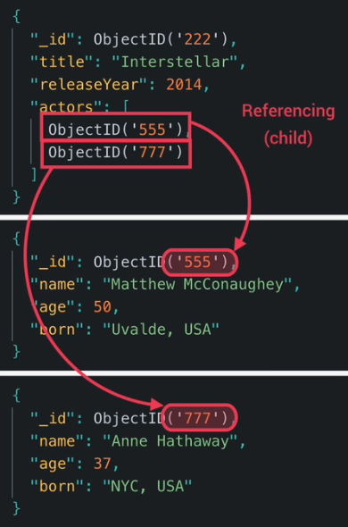

# MongoDB Data Modeling

## Links

- [MongoDB Data Models](https://www.mongodb.com/docs/manual/core/data-modeling-introduction/)
    - Chapter: Data Modeling Concepts
    - Chapter: Data Model Examples and Patters
    - Chapter: Data Model References

Different data models are suited to different use cases. This chapter describes some of the data model concepts and patterns
that MongoDB supports, and provides examples of how to use them.

## Types og Relationships between Data in MongoDB

- One-to-One - One document in one collection references one document in another collection.
- One-to-Many - One document in one collection references many documents in another collection.
- Many-to-Many - Many documents in one collection reference many documents in another collection.

## Data Model Patterns

- Embedded - Embed related data in a single document.
- Referenced - Reference related data in a separate document.
- Denormalized - Duplicate data across multiple documents.
- Normalized - Store related data in a single document.

## Reference vs Embedded

In MongoDB, there are two ways to represent relationships between different documents:

1. Reference (Normalization): A reference is a field that contains a reference to another document in the database.
   The value of the reference field is usually the _id field of the related document. This method is also known as
   normalization, and it allows for better data consistency and reduces data redundancy. However, it requires multiple
   queries to fetch related data.
2. Embedded (Denormalization): In the embedded method, the related data is embedded directly within the main document
   as a nested object or array. This method is also known as denormalization and it improves query performance by reducing
   the number of queries required to fetch related data. However, it can result in data duplication and inconsistencies if
   not properly managed.

So, the main difference between reference and embedded in MongoDB is the way relationships between different documents
are represented. Reference uses a separate document to represent relationships, while embedded stores the related data
directly within the main document.

## Referenced / Normalized

## Embedded / Denormalized

